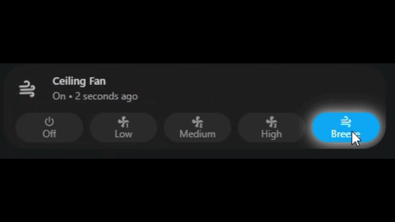

# Fan Speed Visual Center

[](https://github.com/Clooos/Bubble-Card/discussions/2376)



Adds better fan control to Bubble Card with speed-based styling, animation, and color control.

---

## Features

- Detects fan speed (off / low / medium / high)
- Changes styling based on current speed
- Adjusts icon spin speed per level
- Highlights the active sub-button
- Optional glow for the active state
- Supports an off icon
- Color options:
  - Theme colors
  - Color picker
  - Custom CSS / RGBA
  - Templates

---

## Installation

1. Open Home Assistant
2. Go to **Bubble Card → Modules**
3. Click **Import from YAML**
4. Open:
   `fan_speed_visual_center.yaml`
5. Copy/paste it into the editor
6. Save

---

## Usage

```yaml
type: custom:bubble-card
card_type: button
entity: fan.your_fan
name: Fan
icon: mdi:fan
modules:
  - fan_speed_visual_center
